# Laporan Hasil Praktikum: Final Project Aplikasi Berbasis Container

## Identitas Mahasiswa

- **Nama:** Cokorda Gede Bagus Adhi Nindya
- **NIM:** 2415354013
- **Kelas/Rombel:** TRPL 4A
- **Tanggal Praktikum:** 20 Mei 2026

---

## Teknologi & Tools yang Digunakan

- **Sistem Operasi:** Windows x64
- **Containerization:** Docker & Docker Hub
- **Bahasa Pemrograman / Framework:** Node.js
- **Tools Lain:** VS Code, Git, Hoppscotch

---

## Langkah-Langkah Praktikum & Dokumentasi


### Langkah 1: Proses Build Docker Image

Sebelum menjalankan orkestrasi menggunakan Docker Compose, dilakukan pengujian *build* image secara manual untuk memastikan instruksi di dalam `Dockerfile` berjalan tanpa kendala. Karena `Dockerfile` diletakkan terpisah di dalam sub-direktori `backend`, maka *build context* diarahkan secara spesifik ke folder tersebut.

Perintah yang dijalankan pada terminal di root direktori project:
```bash
docker build -t backend-finalproject 
```

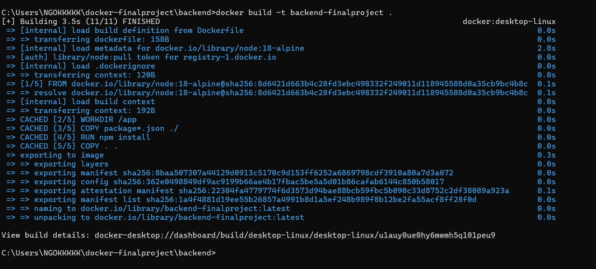

### Langkah 2: Pengujian Docker Compose, Volume, Network, Container

Pada tahap ini, seluruh layanan dikonfigurasi dan dijalankan secara bersamaan menggunakan Docker Compose. Proses ini mengotomatiskan pembuatan container, isolasi jaringan (Network), serta penyimpanan data yang persisten (Volume) sesuai dengan file `docker-compose.yml`.

Perintah untuk menjalankan seluruh *stack* container di latar belakang (*detached mode*):

```bash
docker build -t docker-finalproject
docker compose up -d --build

```

**Dokumentasi/Screenshot:**

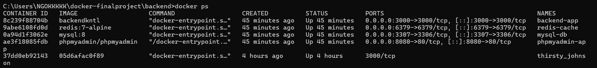
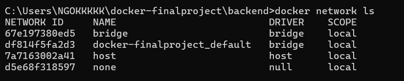
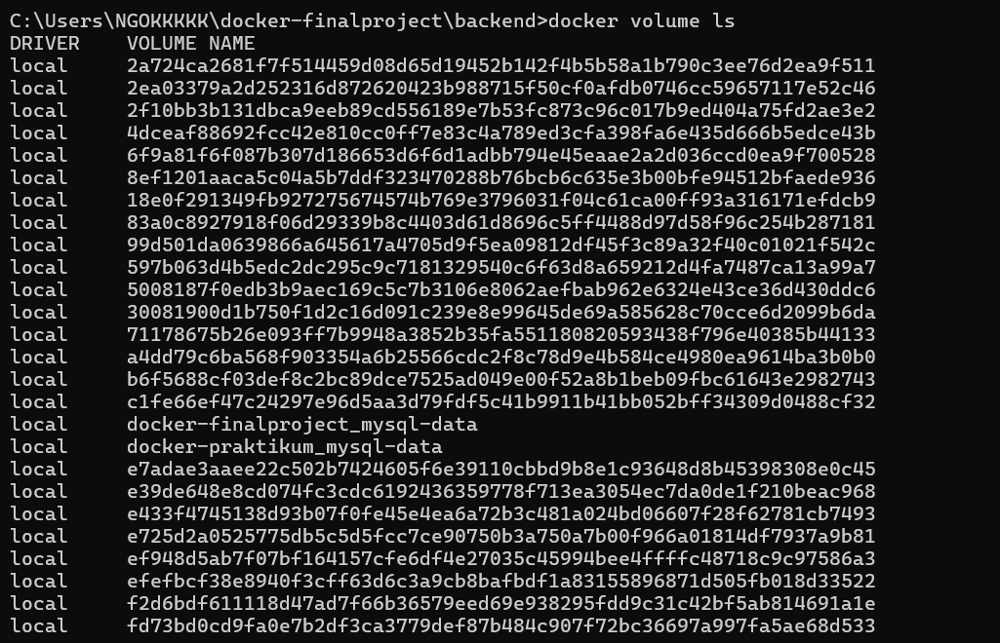
---

### Langkah 3: [⁠⁠Pengujian Endpoint -> Request dan Response (Browser, Postman)]

Setelah container dipastikan berjalan, dilakukan pengujian fungsionalitas aplikasi untuk memastikan bahwa source code di dalam container dapat merespons request dari luar dengan baik melalui port yang telah dipetakan (misalnya port 3000).

Pengujian dilakukan dengan mengirimkan HTTP Request ke http://localhost:3000/ menggunakan Browser atau API Client Hoppscotch untuk melihat strukur data Response yang dikembalikan oleh server.

```bash
docker tag app-good madedianpp/app-good:v1.0
docker push madedianpp/app-good:v1.0
```

**Dokumentasi/Screenshot:**
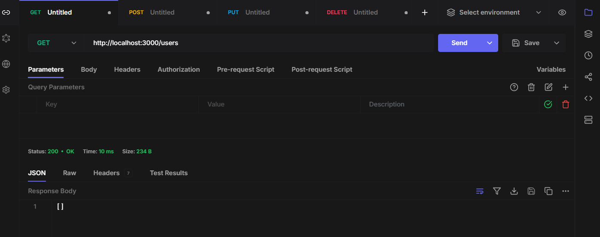
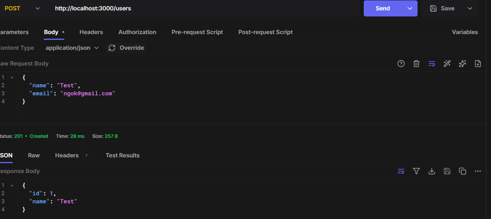
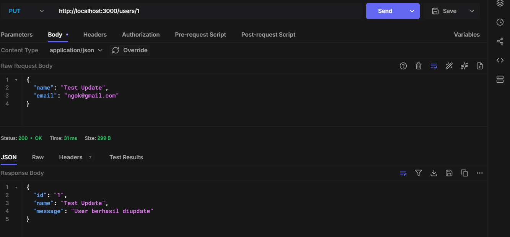
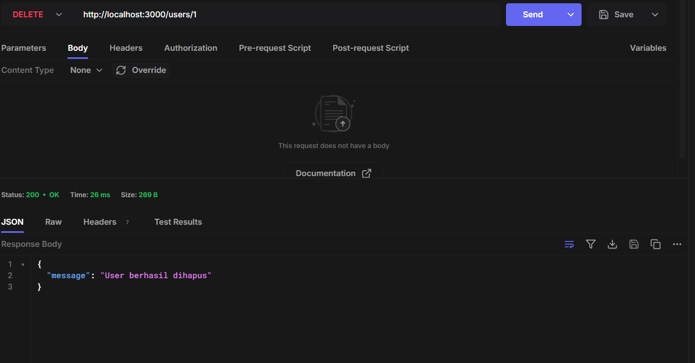

---

### Langkah 4: [⁠Pengujian upload ke Docker Hub]

Langkah ini bertujuan untuk mendistribusikan image lokal ke registri publik Docker Hub agar bisa di-pull oleh server atau perangkat lain. Prosesnya meliputi autentikasi, pemberian tag repositori, dan proses push.

```bash
docker login

docker tag backend-finalproject foxbatt/backend-finalproject

docker push foxbatt/backend-finalproject
```

**Dokumentasi/Screenshot:**
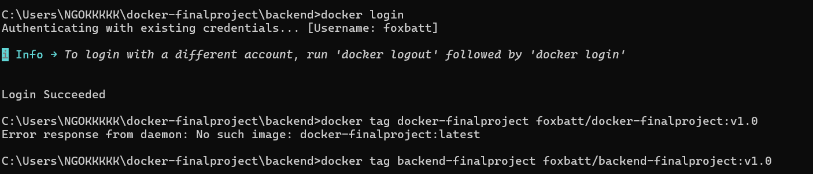
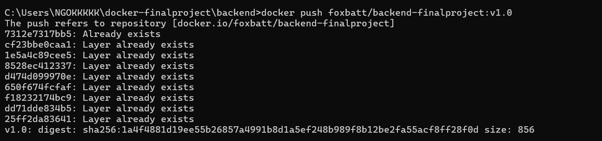

---
### Langkah 5: Pengujian Efisiensi Ukuran Image (Optimasi Node vs Alpine)
Sebagai pengujian tambahan yang diperlukan untuk analisis performa, dilakukan perbandingan efisiensi ukuran ruang disk (disk usage) antara dua skenario base image yang berbeda pada Node.js, yaitu menggunakan image standar (node:latest) dengan image berbasis Alpine Linux (node:18-alpine).
Berdasarkan pengecekan daftar image (docker images), didapatkan perbandingan sebagai berikut:
Image Standar (app-bad): Memiliki ukuran disk usage yang jauh lebih besar (~1.59 GB) karena membawa dependensi OS yang lengkap.
Image Optimasi Alpine (app-good): Berhasil memangkas ukuran secara signifikan (~207 MB) sehingga mempercepat proses deployment dan menghemat penyimpanan.

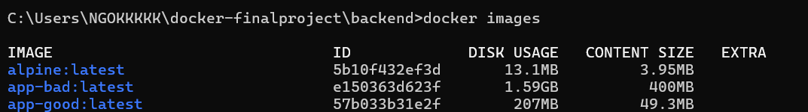

## Kesimpulan
Praktikum Final Project ini berhasil mengintegrasikan seluruh konsep dasar containerization, mulai dari pembuatan lingkungan terisolasi dengan Docker Compose (menguji Container, Network, dan Volume secara sinkron), pengujian responsivitas Endpoint aplikasi, hingga distribusi image ke Docker Hub.

Kendala yang sempat dihadapi adalah penempatan Dockerfile yang berada di dalam sub-folder /backend, sehingga sempat menyebabkan error file tidak ditemukan saat proses build awal dari root direktori. Masalah tersebut berhasil diselesaikan dengan menyesuaikan jalur konteks build (build context) pada perintah Docker atau dengan memanfaatkan konfigurasi otomatis pada Docker Compose. Selain itu, penggunaan base image berbasis Alpine terbukti menjadi solusi terbaik untuk mengoptimalkan efisiensi ukuran image aplikasi.